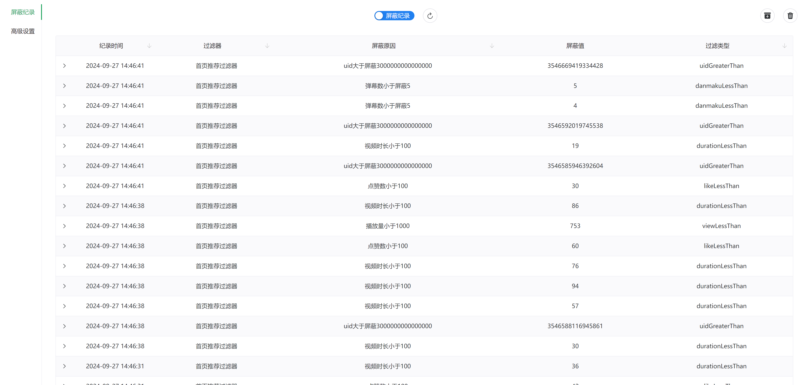
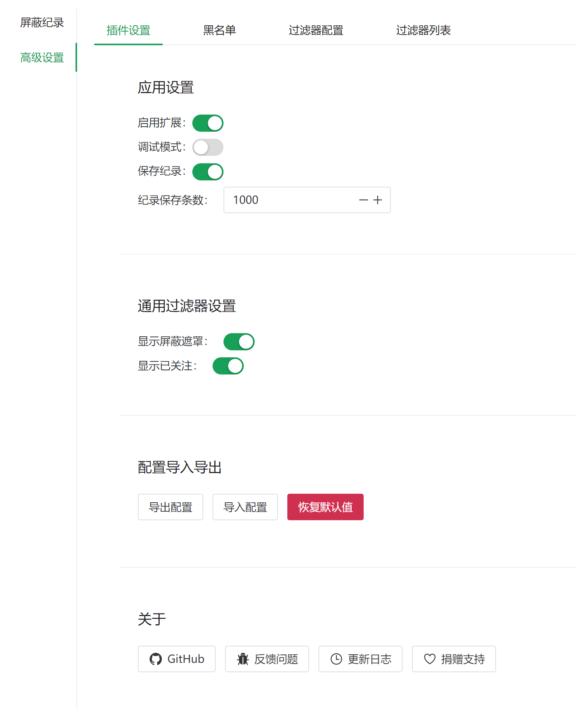
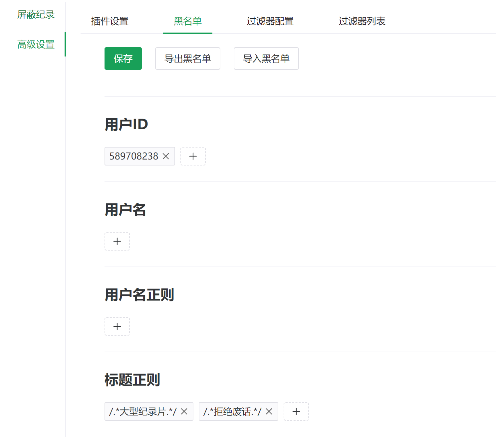
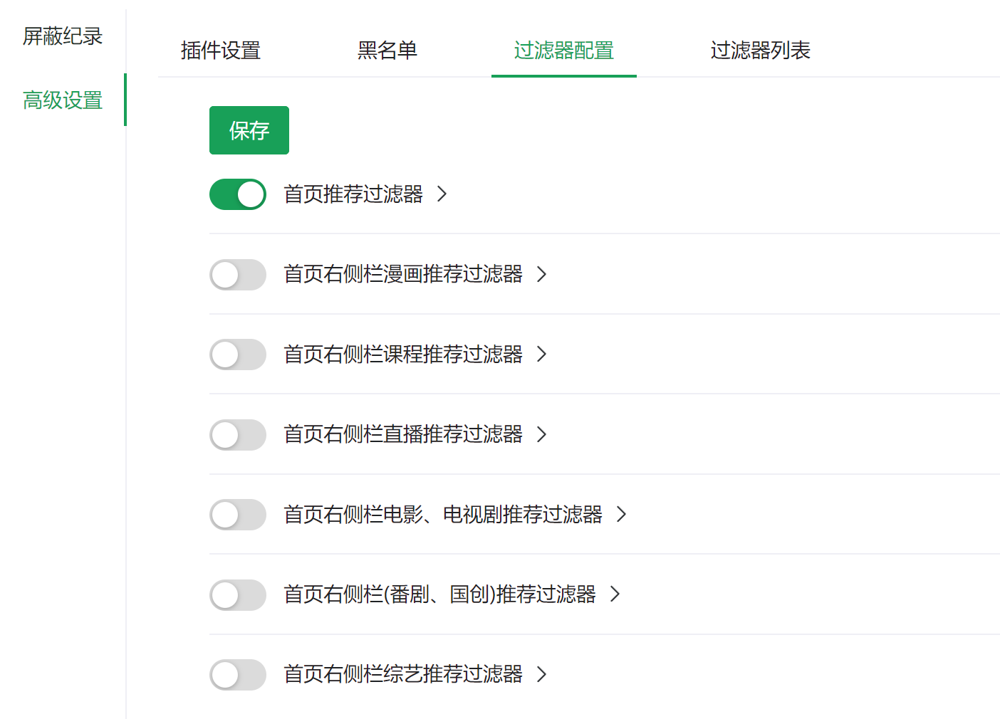
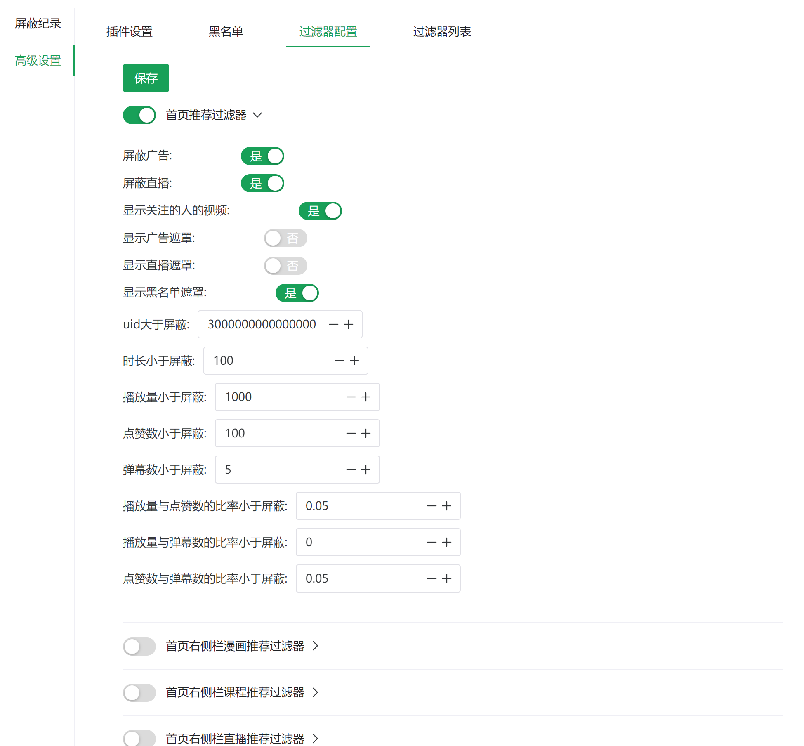
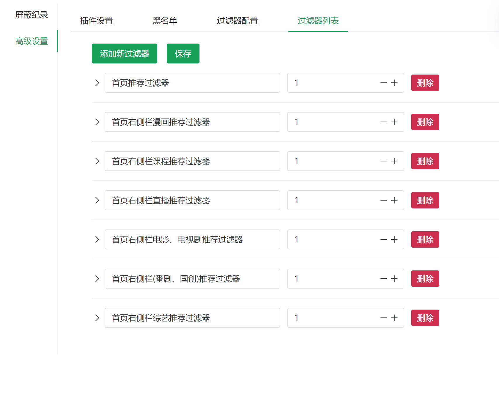
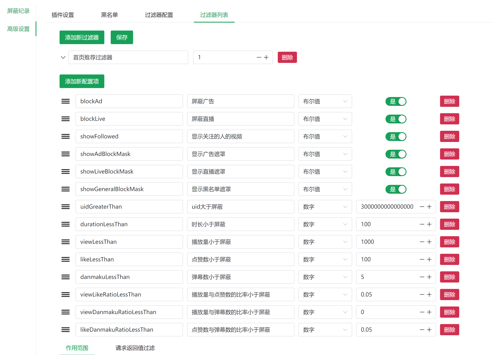
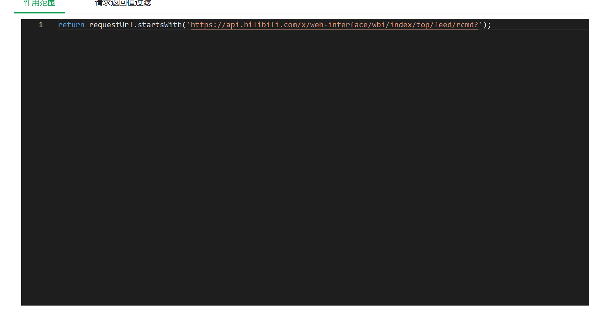
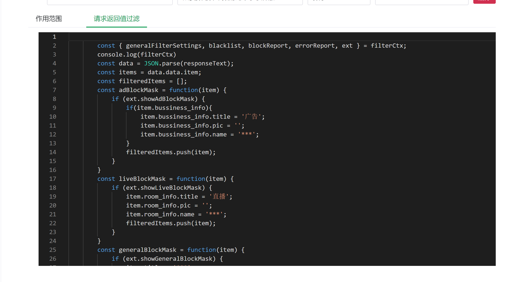

# Bilibili 黑名单插件

## 目录
- [功能介绍](#功能介绍)
- [使用说明](#使用说明)
  - [启动](#启动)
  - [黑名单管理](#黑名单管理)
  - [首页推荐过滤器设置](#首页推荐过滤器设置)
  - [自定义过滤器](#自定义过滤器)
- [界面预览](#界面预览)
- [注意事项](#注意事项)
- [隐私声明](#隐私声明)
- [贡献](#贡献)
- [第三方开源组件](#第三方开源组件)
- [代码参考](#代码参考)
- [许可证](#许可证)
- [捐赠](doc/donate.md)
## 功能介绍

Bilibili 黑名单插件是一个强大的浏览器扩展，可用来修改bilibili请求返回值，用于优化您的 Bilibili 浏览体验。主要功能包括：

1. **黑名单管理**：
   - 用户 ID 黑名单
   - 用户名黑名单
   - 用户名正则表达式黑名单
   - 标题正则表达式黑名单

2. **自定义过滤器**：
   - 创建和管理自定义过滤规则
   - 使用 JavaScript 编写复杂的过滤逻辑

3. **配置导入/导出**：
   - 导出黑名单和过滤器配置
   - 导入配置文件

4. **屏蔽记录**：
   - 查看被屏蔽的内容记录
   - 导出屏蔽记录

5. **默认过滤器**
   1. **首页推荐过滤器**：
      - 屏蔽广告
      - 屏蔽直播
      - 显示/隐藏已关注用户的视频
      - 基于视频数据的高级过滤（如播放量、点赞数、弹幕数等）
      - 自定义 UID 范围过滤
      - 视频时长过滤
      - 播放量、点赞数、弹幕数比率过滤
   2. **首页右侧栏电影、电视剧推荐过滤器**：
      - 屏蔽或遮罩电影和电视剧推荐
   3. **首页右侧栏漫画推荐过滤器**：
      - 屏蔽或遮罩漫画推荐
   4. **首页右侧栏课程推荐过滤器**：
      - 屏蔽或遮罩课程推荐
   5. **首页右侧栏综艺推荐过滤器**：
      - 屏蔽或遮罩综艺推荐
   6. **首页右侧栏直播推荐过滤器**：
      - 屏蔽或遮罩直播推荐
   7. **首页右侧栏(番剧、国创)推荐过滤器**：
      - 屏蔽或遮罩番剧和国创内容推荐

## 使用说明
### 启动
1. 点击插件图片打开选项页面
1. 进入高级设置页面
2. 点击启用扩展（本插件默认不启用）
### 黑名单管理

1. 打开插件设置页面。
2. 在"黑名单"选项卡中，您可以添加、编辑或删除以下类型的黑名单项：
   - 用户 ID
   - 用户名
   - 用户名正则表达式
   - 标题正则表达式
3. 输入相应的值并按回车键添加新项。
4. 点击已添加项目旁的删除按钮可以移除该项。

### 首页推荐过滤器设置

1. 在"过滤器配置"选项卡中，找到"首页推荐过滤器"。
2. 您可以调整以下设置：
   - 启动关闭过滤器
   - 屏蔽广告
   - 屏蔽直播
   - 显示已关注用户的视频
   - 设置各种阈值（如最小播放量、最小点赞数等）

### 自定义过滤器

1. 在"过滤器列表"选项卡中，点击"添加新过滤器"按钮。
2. 为新过滤器设置名称和优先级。
3. 在"作用范围"和"请求返回值过滤"标签页中编写 JavaScript 代码来定义过滤器的行为。
4. 您可以添加配置项来使过滤器更加灵活。

## 界面预览

## 注意事项

- 正则表达式黑名单项需要遵循 JavaScript 的正则表达式语法。

## 隐私声明

本插件仅在本地处理数据，不会将您的黑名单或浏览数据上传到任何服务器。所有的配置和记录都保存在您的浏览器本地存储中。

## 贡献

欢迎提交 issues 或 pull requests 来帮助改进这个项目！

## 第三方开源组件
- [Vue.js](https://cn.vuejs.org/index.html)
- [wxt](https://github.com/wxt-dev/wxt)
- [Navie UI](https://github.com/tusen-ai/naive-ui)
- [bilibili API collect](https://github.com/SocialSisterYi/bilibili-API-collect)
- [Lodash](https://lodash.com/)
- [monaco-editor](https://github.com/microsoft/monaco-editor)
- [monaco-editor-vue3](https://github.com/bazingaedward/monaco-editor-vue3)
- [uuid](https://github.com/uuidjs/uuid)

## 代码参考
- [ajax-tools](https://github.com/PengChen96/ajax-tools)

## 许可证

本项目采用 MIT 许可证